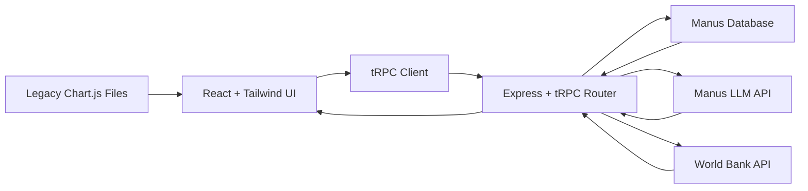

# Global Economic Data Dashboard

**Global Economic Data Dashboard** is a full-stack Manus Platform web application for exploring major macroeconomic indicators from World Bank Open Data. It preserves the original repository's static Chart.js dashboard as a legacy view while introducing a modern React, Tailwind CSS, Recharts, tRPC, Manus Database, and Manus LLM experience.

> The application is intentionally public and login-free. It uses Manus Database for economic data snapshots and cache metadata, while Manus Auth remains scaffolded by the platform template but is not required for dashboard usage.

## Product Scope

The dashboard focuses on ten major economies and six macroeconomic indicators. Users can select countries, switch indicators, adjust the year range, compare country KPI cards, and generate AI-powered summaries from the currently selected data slice.

| Area | Implementation |
|---|---|
| Data source | Repository-provided `economic_data.csv`, derived from World Bank Open Data concepts and indicator codes.[1] |
| New visualization layer | React and Recharts interactive charts for line and bar views.[2] |
| API layer | Public tRPC procedures for catalog, chart data, comparison KPIs, World Bank cache access, and LLM insights.[3] |
| Persistence | Manus Database tables for data snapshots, economic data points, World Bank API cache entries, and insight requests. |
| AI | Server-side Manus LLM helper generates concise economic summaries without exposing credentials to the browser. |
| Legacy preservation | Original Chart.js dashboard files are available under `/legacy` so the cloned logic remains inspectable and usable.[4] |
| SEO/OGP | Descriptive metadata and a dedicated 1200×630 preview image are configured in `client/index.html`. |

## Feature Set

The primary dashboard shell is named `DashboardLayout` and provides a dark-first sidebar navigation structure with light/dark theme toggling. The main UI supports an overview page, an explorer page, a country comparison page, an AI insights page, and a legacy dashboard page.

| Route | Purpose |
|---|---|
| `/` | Executive overview with controls, latest KPI cards, Recharts trend chart, comparison cards, and AI insight panel. |
| `/explorer` | Focused chart exploration with line chart and latest-year bar chart. |
| `/comparison` | Side-by-side country KPI cards for GDP, population, inflation, unemployment, FDI, and foreign reserves. |
| `/insights` | Dedicated interface for generating AI-powered trend summaries from selected data. |
| `/legacy` | Embedded and linked preserved Chart.js dashboard from the original repository. |

## Data Model

The database schema is defined in `drizzle/schema.ts`. It stores normalized observations rather than wide CSV rows, making country, indicator, and year-range filtering straightforward.

| Table | Purpose |
|---|---|
| `economic_snapshots` | Tracks source file, hash, record count, and generation timestamps. |
| `economic_data_points` | Stores country, indicator, year, value, unit, format, source, and World Bank indicator code. |
| `world_bank_cache` | Stores World Bank API responses by cache key with fetch timestamps. |
| `insight_requests` | Stores prompt, response, indicator, countries, and year range for generated AI insight history. |
| `users` | Scaffolded Manus template table; not required for public dashboard usage. |

## tRPC API Surface

All dashboard procedures are public because the user requested no login or signup flow. Authentication-related template procedures remain present only for platform compatibility.

| Procedure | Type | Description |
|---|---:|---|
| `economic.catalog` | Query | Returns countries, indicators, year range, record count, and snapshot metadata. |
| `economic.chartData` | Query | Filters economic observations by country list, indicator, and year range, then returns chart-ready series. |
| `economic.comparison` | Query | Returns latest KPI values and one-period change metadata by selected country. |
| `economic.worldBank` | Query | Fetches a specific World Bank indicator range and caches the response in the database. |
| `economic.insight` | Mutation | Generates a markdown economic summary through the Manus LLM API and records the request. |

## Architecture

The React client never directly calls the Manus LLM API or writes to the database. Those operations run server-side in tRPC procedures, keeping credentials inside the managed runtime and returning only structured results to the UI.

## Development Commands

| Command | Purpose |
|---|---|
| `pnpm dev` | Run the local development server. |
| `pnpm test` | Run Vitest coverage for auth and economic tRPC procedures. |
| `pnpm check` | Run TypeScript checking. |
| `pnpm build` | Build the Vite frontend and bundled Express server. |
| `pnpm drizzle-kit generate` | Generate SQL migrations from Drizzle schema changes. |
| `pnpm drizzle-kit migrate` | Apply generated migrations to the configured database. |

## References

[1]: https://data.worldbank.org/ "World Bank Open Data"  
[2]: https://recharts.org/en-US/ "Recharts Documentation"  
[3]: https://trpc.io/ "tRPC Documentation"  
[4]: https://www.chartjs.org/ "Chart.js Documentation"
